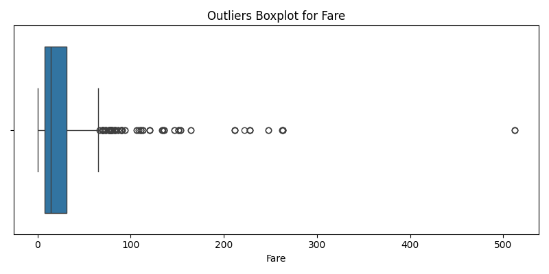
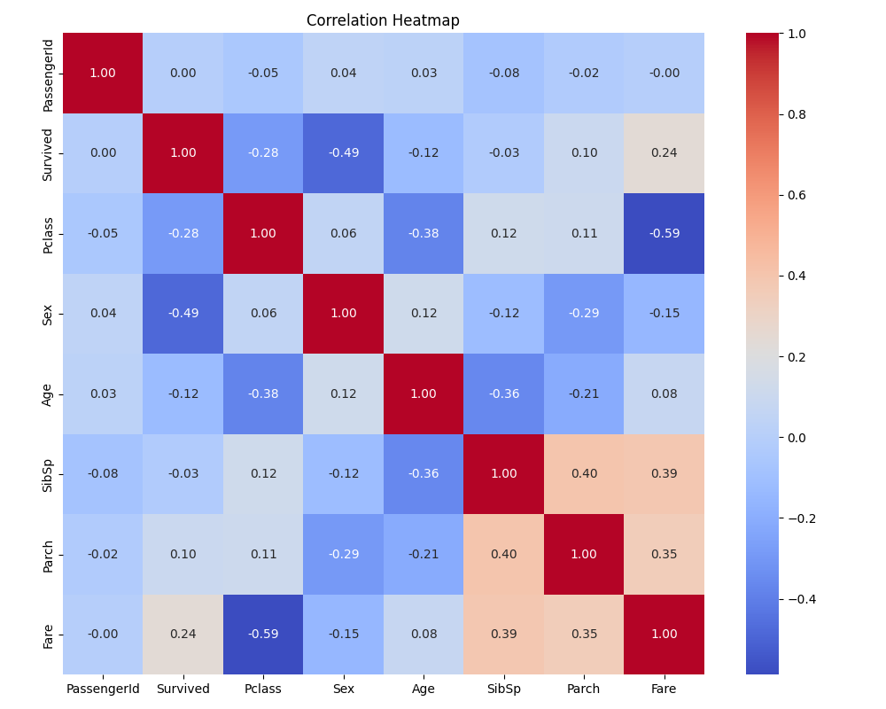

# 🧹 Task 1 — Data Cleaning & Preprocessing (Titanic Dataset)

## 📘 Overview
This project focuses on **data preprocessing and cleaning** using the **Titanic dataset**, a foundational step in any Machine Learning pipeline.  
The goal is to clean raw data, handle missing values, encode categorical variables, detect & remove outliers, and visualize relationships before model training.

---

## 🎯 Objectives
- Handle missing and inconsistent data.  
- Encode categorical variables into numerical form.  
- Normalize and scale numerical features.  
- Detect and remove outliers.  
- Visualize correlations and data distributions.

---

## 🧠 Concepts Covered
- Missing data handling (mean, mode imputation)
- Label and one-hot encoding
- Standardization and normalization
- Outlier detection using IQR method
- Visualization using Matplotlib and Seaborn

---

## 🗂️ Project Structure
```
Task1-Preprocessing/
│
├── Data/
│   └── titanic-Dataset.csv
│
├── src/
│   ├── data_cleaning.py
│   ├── encoading_scaling.py
│   ├── outlier_detection.py
│   └── visuals.py
│
├── outputs/
│   ├── cleaned_titanic.csv
│   └── visuals/
│       ├── outliers_boxplot_Fare.png
│       └── correlation_heatmap.png
│
├── main.py
└── README.md
```

---

## ⚙️ How It Works
1. **Data Cleaning:**  
   - Fills missing `Age` values with the mean.  
   - Replaces missing `Embarked` entries with the mode.  
   - Drops irrelevant or duplicate columns if any.

2. **Encoding & Scaling:**  
   - Converts categorical columns like `Sex`, `Embarked`, and `Pclass` into numeric form.  
   - Scales continuous variables (`Fare`, `Age`) for consistency.

3. **Outlier Detection:**  
   - Uses the **IQR (Interquartile Range)** method to detect and remove extreme values.

4. **Visualization:**  
   - Generates **Boxplots** and **Correlation Heatmaps** to show data quality improvements and relationships.

---

## 📊 Results

### 🔹 Outliers Boxplot for Fare


### 🔹 Correlation Heatmap


---

## 🧰 Tools & Libraries
- **Python 3.12+**
- **Pandas**
- **NumPy**
- **Matplotlib**
- **Seaborn**
- **Scikit-learn**

---

## ▶️ Run the Project
1. Clone this repository:
   ```bash
   git clone https://github.com/<your-username>/Task1-Preprocessing.git
   cd Task1-Preprocessing
   ```

2. Create a virtual environment and install dependencies:
   ```bash
   uv venv
   uv pip install -r requirements.txt
   ```

3. Run the pipeline:
   ```bash
   python main.py
   ```

4. Processed outputs and visuals will be saved in:
   ```
   outputs/
   ```

---

## 🧾 References
- Dataset: [Titanic Dataset on Kaggle](https://www.kaggle.com/datasets/yasserh/titanic-dataset)
- Internship Guide: AI & ML Task 1 — Data Cleaning and Preprocessing
